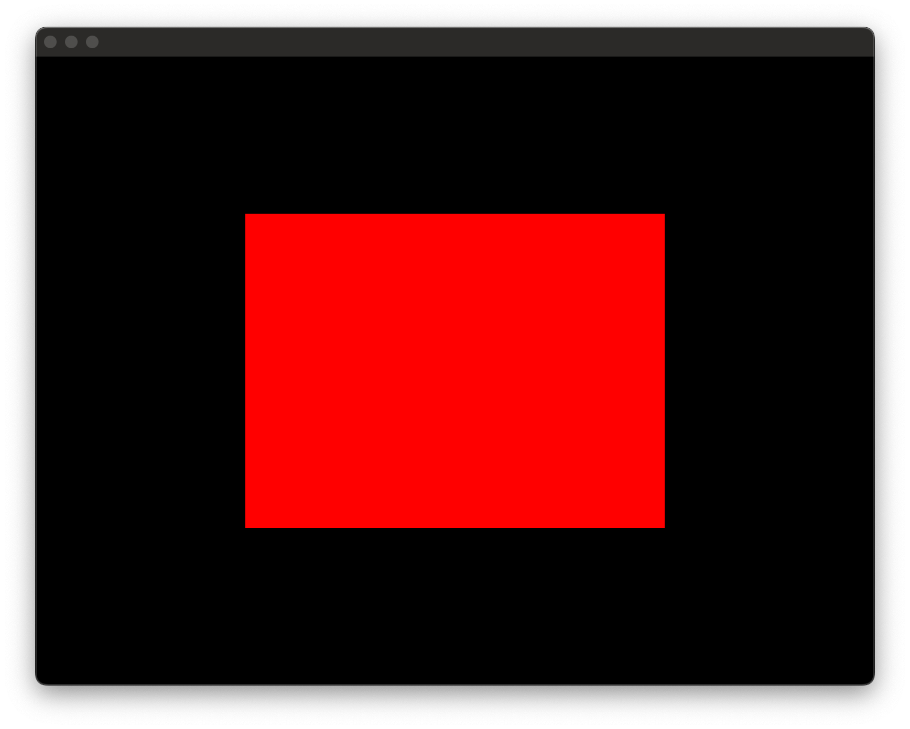

Graphics
========

**Graphics** is a lightweight C++ library that serves as a wrapper around multiple graphics APIs, enabling developers to use different backends with a unified codebase.

This project simplifies the development process of graphical applications by abstracting platform-specific code, which is managed through CMake. As a result, developers can focus on the core functionality of their applications without needing to worry about the complexities of underlying graphics APIs.

This library is still in active development, with new features and improvements being added regularly.

Features
--------

This library uses **GLFW** to open windows and handle basic input, which is then redirected through an event system.  
By using an instance of the `GraphicAPI` class, developers can interact with the GPU in a platform-agnostic manner.  
Currently, **Graphics** supports **Metal** on macOS and **OpenGL** on all platforms. The long-term goal is to phase out OpenGL support and provide implementations for **DirectX** on Windows and **Vulkan** on Windows and Linux.  
Additionally, it integrates [imgui](https://github.com/Thomas-Chqt/imgui/tree/cmake) for creating graphical user interfaces.

In terms of GPU functionality, **Graphics** supports the use of:

- GPU buffers
- Vertex and fragment shaders
- Textures (2D and cubemap)
- Samplers
- Framebuffers

This feature set enables the creation of basic 3D applications. However, advanced techniques such as instanced rendering or mesh shaders are not yet supported.

Build
-----

CMake is used as the build system. The recommended way to use the library is to clone the repository inside your project and use `add_subdirectory`.

Alternatively, the library can be built separately using CMake.

The repository must be cloned instead of downloading it as a zip file in order to resolve the submodules when configuring the project with CMake. Recursive cloning is not required as everything is managed through CMake.

```sh
mkdir build
cmake -S . -B build
cmake --build build
```

All dependencies are embedded in the project using either Git submodules or CMake's FetchContent, so it should work out of the box. However, if compilation fails, please verify the requirements for each dependency, especially GLFW on Linux.

### CMake Options

| Option                | Default Value | Description                          |
|-----------------------|---------------|--------------------------------------|
| `GFX_BUILD_EXAMPLES`  | `OFF`         | Build example applications           |
| `GFX_BUILD_IMGUI`     | `OFF`         | Include support for ImGui            |
| `GFX_INSTALL`         | `ON`          | Enable installation of the library   |
| `GFX_BUILD_METAL`     | `ON`          | Build the Metal backend (macOS only) |
| `GFX_BUILD_OPENGL`    | `ON`          | Build the OpenGL backend             |

Usage
-----

For more details, check the examples (note: some may require building the library with ImGui).  
Here's a quick overview of the library's design.

1.  **Initialization and Termination**  
    Start by initializing the library with `gfx::Platform::init()`. Don’t forget to call `gfx::Platform::terminate()` before your program exits to clean up properly.

2.  **Window Management**  
    `Platform` is a globally accessible singleton that handles creating windows and managing the graphics API. You can create a new window with `gfx::Platform::shared().newWindow(int width, int height)`. Windows are managed with shared pointers, so when they're no longer referenced, they’re automatically deleted and closed.

3.  **Interacting with the GPU**  
    To work with the GPU, you need an instance of the `GraphicAPI` class. Get this by calling `gfx::Platform::shared().newGraphicAPI(const utils::SharedPtr<Window>& window)` using the window you just created. This `GraphicAPI` instance allows you to create GPU objects and issue draw calls.

4.  **Creating Graphics Objects**  
    Now, you can create essential GPU resources:
    
    - Vertex buffers with `GraphicAPI::newBuffer(const Buffer::Descriptor&)`
    - Shaders with `GraphicAPI::newShader(const Shader::Descriptor&)`
    - Textures with `GraphicAPI::newTexture(const Texture::Descriptor&)`

5.  **Setting Up a Graphics Pipeline**  
    To render anything, you'll need a `GraphicPipeline`. This holds the details the GPU needs, like vertex buffer formats, shaders, and pixel formats.
    
6.  **Rendering Loop**  
    In your render loop, make sure to call `gfx::Platform::shared().pollEvents()` on every iteration to handle window events.
    
    A frame starts with `GraphicAPI::beginFrame()` and ends with `GraphicAPI::endFrame()`. Between those, you'll define one or more render passes:
    
    - A render pass starts with `GraphicAPI::beginRenderPass()` and ends with `GraphicAPI::endRenderPass()`.  
    By default, a pass renders to the window, but you can pass a framebuffer to render off-screen.

7.  **Issuing Draw Calls**  
    Inside a render pass, you can issue draw calls, but first, you need to:
    
    - Select a `GraphicPipeline` with `GraphicAPI::useGraphicsPipeline(const utils::SharedPtr<GraphicPipeline>&)`
    - Set up the necessary data (like buffers and textures) with methods such as `GraphicAPI::setVertexBuffer()` and `GraphicAPI::setFragmentTexture()`
    
    After everything is ready, you can use the following draw calls:
    
    - `GraphicAPI::drawVertices(utils::uint32 start, utils::uint32 count)`
    - `GraphicAPI::drawIndexedVertices(const utils::SharedPtr<Buffer>& indices)`

Though **Graphics** is still a work in progress and lacks some features, the goal is to keep it easy to use. More improvements are coming as the project evolves.

Examples
--------

- **Material editor**  
A demo showcasing a basic material editor, illustrating how normal maps and emissive textures are applied to 3D models.


- **Offscreen Render Pass**  
This example demonstrates how to use a framebuffer for rendering to a texture. The first render pass clears the framebuffer to red without issuing any draw commands, while the second pass uses the resulting texture from the first pass and renders it onto a 2D quad.




Libraries
---------

**Graphics** depends on several libraries, some of which I created, and others are open-source libraries that serve specific purposes in this project:

- **[UtilsCPP](https://github.com/Thomas-Chqt/UtilsCPP)**: A utility library I created, containing various data structures and algorithms used throughout the project for general functionality.
- **[Math](https://github.com/Thomas-Chqt/Math)**: A math library I developed, providing vector and matrix classes and functions essential for graphics operations.
- **[GLFW](https://github.com/glfw/glfw)**: A popular open-source library used for creating windows and handling input events.
- **[GLAD](https://github.com/Thomas-Chqt/GLAD)**: A library for loading OpenGL functions, ensuring that all necessary OpenGL extensions are available for cross-platform rendering.
- **[imgui](https://github.com/Thomas-Chqt/imgui)**: Integrated for building efficient user interfaces. **Graphics** initializes the necessary components to support imgui.

Additionally, some example applications also use:

- **[assimp](https://github.com/assimp/assimp)**: A library for importing 3D models and meshes, commonly used for asset loading.
- **[stb_image](https://github.com/Thomas-Chqt/stb_image)**: A lightweight image loading library, useful for loading textures in the project.

Learning
--------

This project dramatically expanded my understanding of GPU programming, especially since I started with no prior knowledge. Before this, my experience with graphics was limited to CPU-based pixel manipulation. As I worked on abstracting multiple graphics APIs, I was able to recognize the core principles of graphics programming that are common across different APIs, which allowed me to develop a deeper understanding of how GPUs operate.

The most interesting part of GPU programming for me was working with shaders. The challenge of programming for such high levels of parallelization was unlike anything I had encountered before, and it shifted my thinking from step-by-step programming to a more elegant, parallel approach. It made me appreciate the power and efficiency of GPUs in ways I hadn’t considered before.

Building this abstraction library involved a lot of refactoring. It wasn’t easy, as I had to balance learning OpenGL and Metal while simultaneously developing the library. However, by continuously iterating on the design and overcoming obstacles, I gained invaluable knowledge. The experience taught me the value of persistence and how breaking down complex problems into smaller, manageable pieces can lead to a much deeper understanding.

I’m especially proud of how the API turned out. I believe it strikes a great balance between ease of use and flexibility, even if the capabilities of the library are still evolving. This project has been a pivotal step in my journey to mastering graphics programming, and I look forward to applying this experience to even more complex projects in the future. If I had the chance, I would love to apply this experience to similar projects in a professional setting. The skills I gained from building this library have been invaluable, and I’m confident they will serve me well in future projects and my career. While the library is functional, I’m excited to continue refining it, adding new features, and expanding its capabilities to support more advanced use cases.

References
----------

### OpenGL Resources
I learned OpenGL through various high-quality resources, including:

- **[LearnOpenGL](https://learnopengl.com)**: A comprehensive website offering detailed tutorials on OpenGL concepts, from basic to advanced.
- **[OGLDEV YouTube Channel](https://www.youtube.com/@OGLDEV)**: A YouTube channel dedicated to OpenGL tutorials, providing practical demonstrations of key OpenGL concepts.
- **[The Cherno's OpenGL Series](https://www.youtube.com/playlist?list=PLlrATfBNZ98foTJPJ_Ev03o2oq3-GGOS2)**: A series of videos by The Cherno, focusing on OpenGL, with easy-to-follow explanations and practical coding examples.

### Metal Resources
Resources on Metal were more limited, but I relied on the following:

- **[Metal Tutorial](https://metaltutorial.com)**: A well-organized website offering Metal tutorials that cover everything from setup to advanced rendering techniques.
- **[Metal by Example](https://metalbyexample.com)**: Another excellent resource that offers concise and clear examples for learning Metal programming.
- **[Apple's Official Metal Documentation](https://developer.apple.com/documentation/metal/)**: The official Apple documentation, which is comprehensive and essential for learning Metal, though often requires interpretation due to its technical nature.