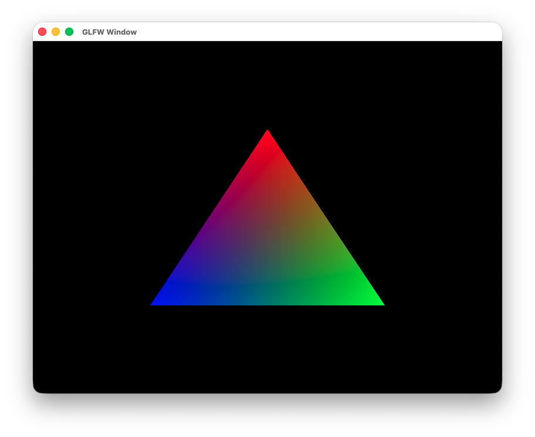
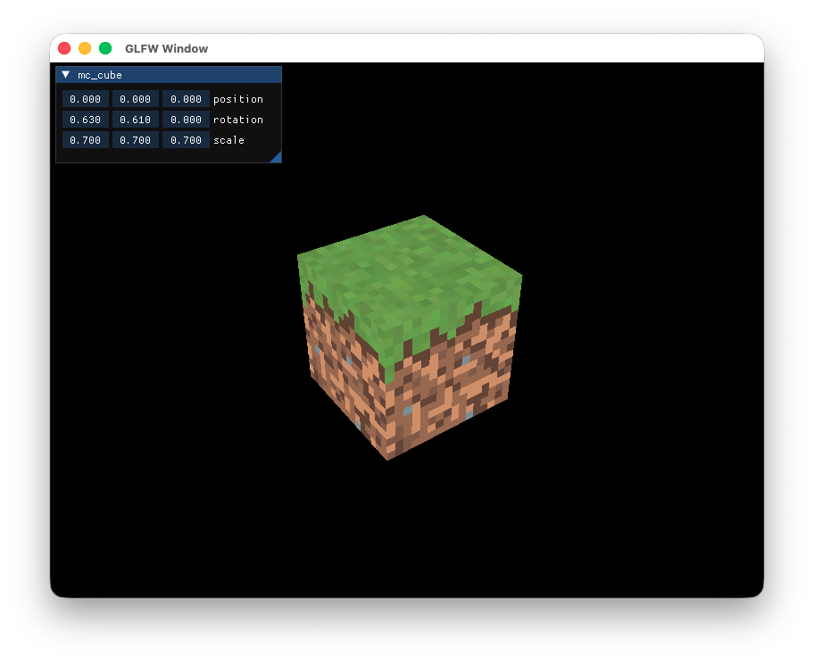
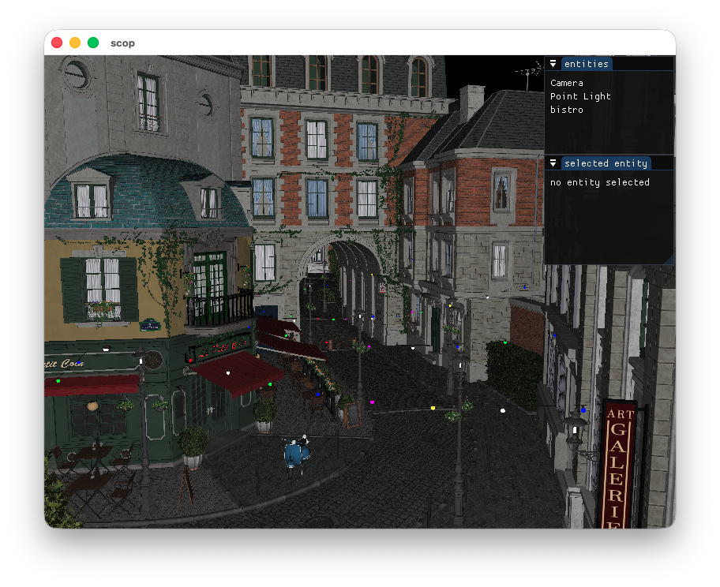

Graphics
========

**Graphics** is an abstraction layer on top of Metal and Vulkan that I use in all my graphics-related projects. It is also a place to experiment with and learn new rendering techniques.

Platform Support
----------------

| Platform | Metal | Vulkan |
|----------|-------|--------|
| macOS    | [](https://github.com/Thomas-Chqt/Graphics/actions/workflows/macos-metal.yml) | [](https://github.com/Thomas-Chqt/Graphics/actions/workflows/macos-vulkan.yml) |
| Windows  | N/A | [](https://github.com/Thomas-Chqt/Graphics/actions/workflows/windows.yml) |
| Linux    | N/A | [](https://github.com/Thomas-Chqt/Graphics/actions/workflows/linux.yml) |

Features
--------

- **Dynamic backend switching**: Switch between backends without rebuilding or restarting the application, simply recreate the instance
- **Automatic synchronization**: All resources are tracked inside and across command buffers, with barriers and semaphores inserted automatically when necessary
- **Resource lifetime management**: All resources use RAII and are shared using smart pointers, so there's no need to keep staging buffers alive until commands execute, buffers can go out of scope as soon as they're no longer needed
- **Optional dependencies**: External libraries are not linked unless used. GLFW and ImGui *capabilities* can be enabled, but it is the user's responsibility to provide the libraries. The few required functions are loaded dynamically, allowing you to build the library with all capabilities once and then use only what's needed in each project without linking everything every time

Build
-----

CMake is used as the build system. The recommended way to use the library is to clone the repository inside your project and use `add_subdirectory`.

Alternatively, the library can be built separately using CMake.

Here is an example to build the library as well as all the examples in release mode for best performance:
```sh
cmake -S . -B build -DCMAKE_BUILD_TYPE=Release -DGFX_ENABLE_GLFW=ON -DGFX_BUILD_EXAMPLES=ON
cmake --build build
```

All dependencies are embedded in the project using CMake's FetchContent, except for the Vulkan loader, MoltenVK, and the Metal framework.
On Windows and Linux with up-to-date GPU drivers, it should work out of the box.
On macOS, Vulkan requires the `vulkan-loader` and `molten-vk` Homebrew packages, and Metal requires the MetalToolchain.

### CMake Options

| Option                | Default Value | Description                          |
|-----------------------|---------------|--------------------------------------|
| `GFX_BUILD_METAL`     | `ON`          | Build the Metal backend (macOS only) |
| `GFX_BUILD_VULKAN`    | `ON`          | Build the Vulkan backend             |
| `GFX_ENABLE_IMGUI`    | `OFF`         | Enable ImGui capability              |
| `GFX_ENABLE_GLFW`     | `OFF`         | Enable GLFW capability               |
| `GFX_BUILD_EXAMPLES`  | `OFF`         | Build the example executables        |
| `GFX_INSTALL`         | `ON`          | Enable the CMake install command     |

> **Note**: Examples that use GLFW (all of them) and ImGui will not be built if the capabilities are not enabled.

Examples
--------
- **triangle**: Demonstrates the most basic code required to render a triangle

- **mc_cube**: Demonstrates more advanced usage such as uniform buffers and textures

- **scop**: The most advanced example, showcasing the latest features of the library with a 3D renderer that supports loading models and materials using Assimp


Libraries
---------

**Graphics** depends on a few libraries:
- **Vulkan Loader**: Should be installed with your GPU drivers on Windows and Linux. On macOS, it requires installing the `vulkan-loader` and `molten-vk` Homebrew packages. The Vulkan functions are dynamically loaded at runtime, so the library can still build even if the Vulkan loader is not installed. Vulkan can also be disabled completely on macOS using `-DGFX_BUILD_VULKAN=OFF` during CMake configuration.
- **MetalToolchain**: Recent versions of Xcode do not include the Metal toolchain. It can be installed in the Components settings or with the command `xcodebuild -downloadComponent MetalToolchain`
- **[Vulkan-Headers](https://github.com/KhronosGroup/Vulkan-Headers)**: Especially the Vulkan HPP header included in the repository
- **[dlLoad](https://github.com/Thomas-Chqt/dlLoad)**: Only required when ImGui or GLFW capabilities are enabled. Used to load shared libraries and functions dynamically.
- **[slang](https://github.com/shader-slang/slang)**: Used as a common shader language. The Slang compilation API is used in the `gfxsc` tool to build shaders.

Additionally, some example applications also use:

- **[GLFW](https://github.com/glfw/glfw)**: A popular open-source library for creating windows and handling input events
- **[ImGui](https://github.com/Thomas-Chqt/imgui)**: Integrated for building efficient user interfaces. **Graphics** initializes the necessary components to support ImGui.
- **[stb_image](https://github.com/Thomas-Chqt/stb_image)**: A lightweight image loading library for loading textures
- **[Assimp](https://github.com/assimp/assimp)**: A library for importing 3D models and meshes, commonly used for asset loading
